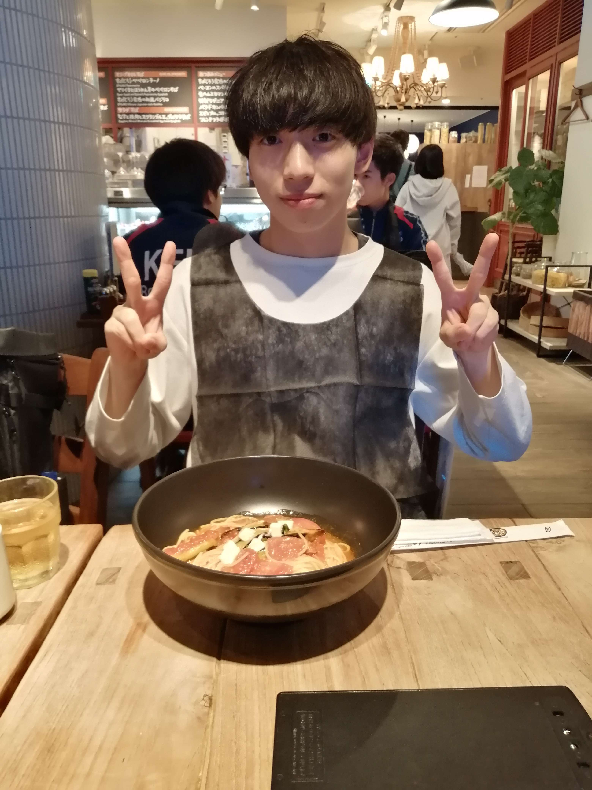
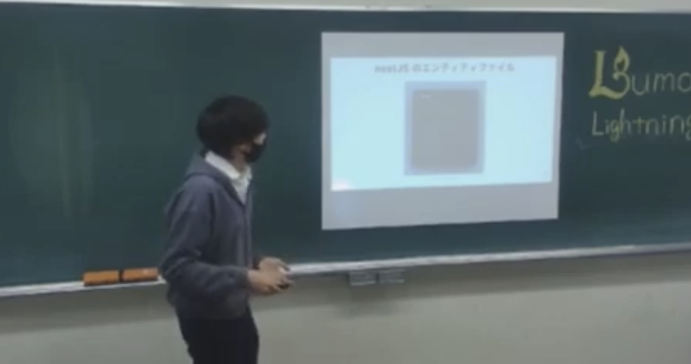
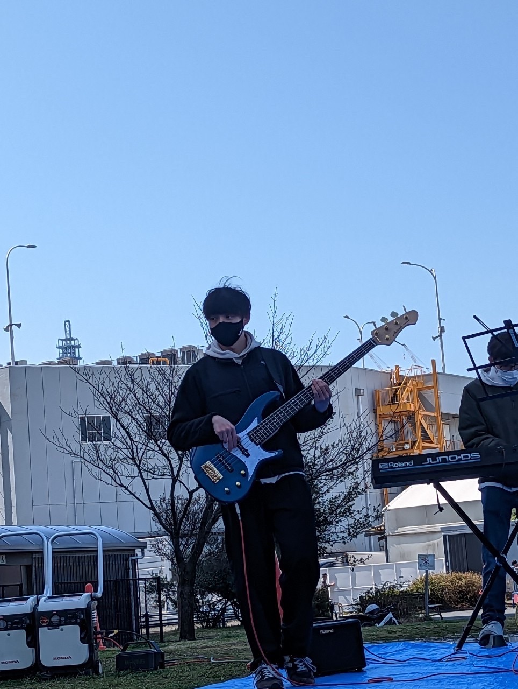
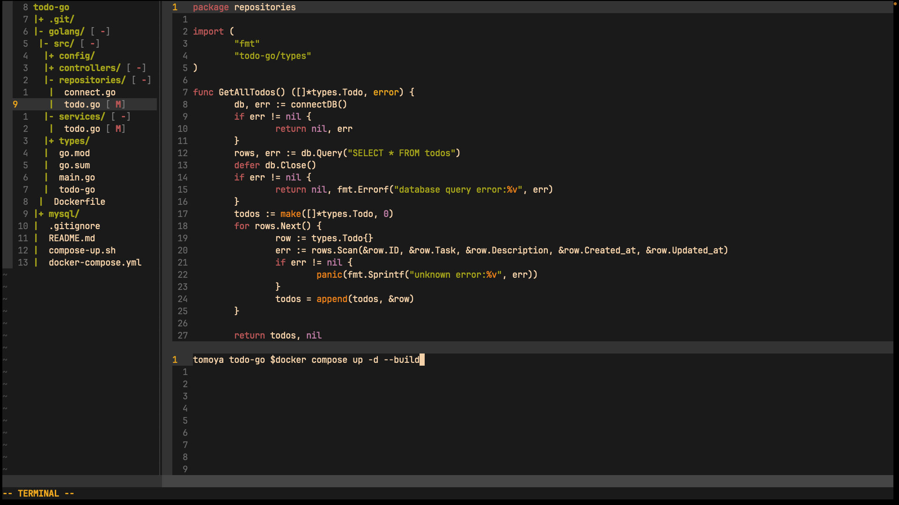
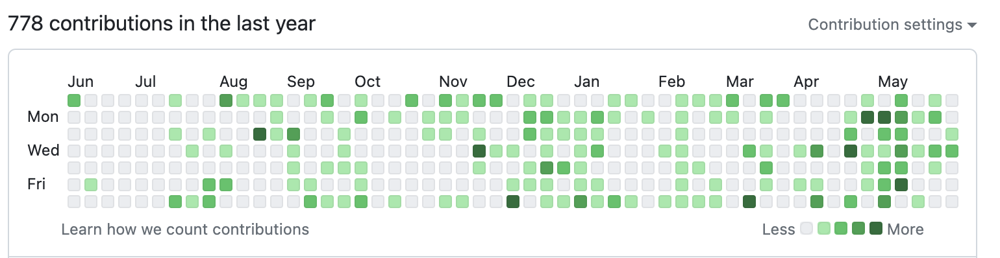
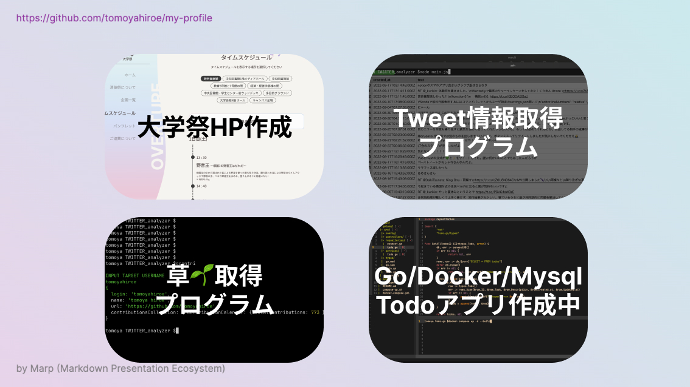
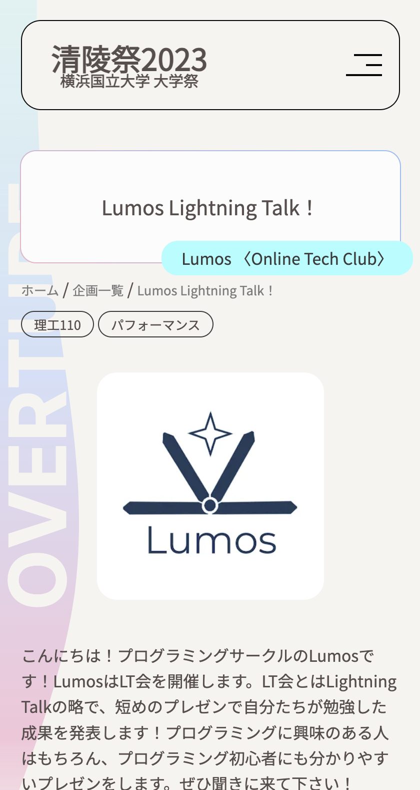
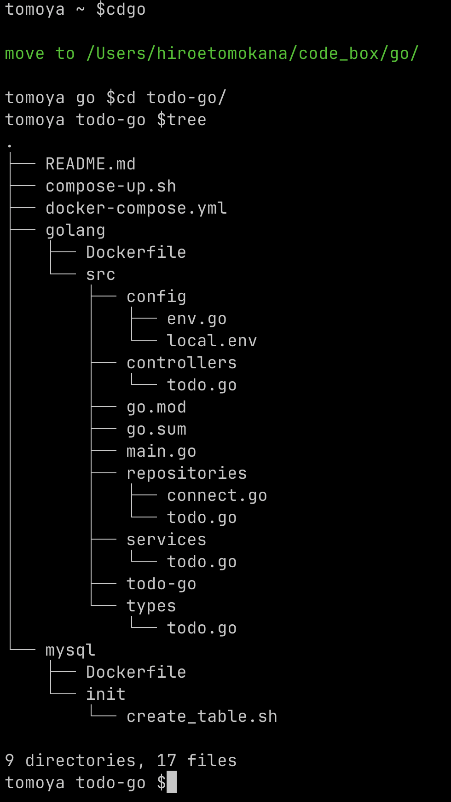
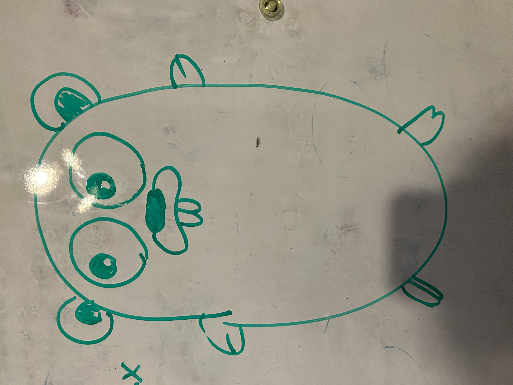

# 1on1イベント用 自己PR資料

### 廣江 友哉(github.com/tomoyahiroe)
### 横浜国立大学経済学部

---
# めちゃくちゃ自分語りします🙇‍♂️

お付き合いください、よろしくお願いします。
1. **自己紹介**
2. **開発経験、プログラミング周りについて**
3. **将来像について**

---

<!-- 
_color: white
-->

# 1. まずは、自己紹介から

---

- 廣江 友哉 (ひろえ ともや)
- 大阪生まれ、東京育ち、川崎在住
- GitHub: **[tomoyahiroe](https://github.com/tomoyahiroe)**
- Twitter: **[@yudetamageta](https://twitter.com/@yudetamageta)**

---

## 所属
1. 横浜国立大学経済学部
2. Lumos元運営 (プログラミングサークル)
3. 学祭実行委員 (大学祭のWebサイト作成)
4. Accoustic Style (音楽サークル)
5. インターン先

---

## 趣味は音楽、楽器はベースです！
### 好きなコピー曲3選
- **[名前を呼ぶよ SUPER BEAVER](https://www.youtube.com/watch?v=sZCo_Xm8vmo)**
- **[ナイトクロージング Saucy Dog](https://www.youtube.com/watch?v=NP6dy9ZWyA0)**
- **[六角橋欄ランデヴー くずれ餅屋](https://www.youtube.com/watch?v=xF5kgOPaKxs)**
### 好きなアーティスト
- King Gnu (6/3のライブ最高でした)
- Saucy Dog
- Ed Sheeran
- Harry Styles
---
<!--
_color: white
-->

# 2. 開発経験、プログラミング周りについて

---

## 2-1. プログラミングを始めた経緯
- webサイトやアプリの仕組みへの純粋な興味から独学
- 大学一年の夏にプログラミングサークルLumosを立ち上げる
- これまで、WEBフロントエンド・バックエンドの開発を学習

---
## 2-2. 個人?開発物

---

---
<!--
_header: https://seiryo.ynu-fes.yokohama/
-->

### 2-2-1. Nuxt.jsで大学祭ホームページを作成
- **設計・デザイン・コーディングまで2人で開発**
- Nuxt.js 3.x / GAE を使用
- 工夫した点
  1. スマホファーストな設計に
  2. コンポーネントを繰り返し利用し統一感を出す
  3. 押して欲しい箇所には必ず動きをつける
- 発見
  1. 何よりもスケジュール管理が難しい
  2. コンポーネントの一番外側のクラスは命名規則を作るべき

---

### 2-2-2. Go/Docker/MysqlでTodoアプリ作成中
- Node.jsやLaravelで組んだことのあるバックエンドをGolangで組めるか挑戦
- 工夫した点
  1. Neovimの練習ついでに(スライド7枚目参照)
  2. ymlファイルは自作
  3. MVC + Service + Repositoryの構成を意識
  4. repositoriesパッケージ外からDB操作をできない
  5. エラーハンドリングの学習がてら

---

## 2-3. 業務経験

- 株式会社estraでインターンとしてプログラミングスクールの質問対応(**Laravel, Vue.js, Docker**)
- 同じ会社で、GitHubでの共同開発の方法を提案したり、LPを作成したり
- 7月からユースタイルラボラトリー株式会社でインターンを開始予定

---

# 3. 将来について

---

## 3-1. なりたいエンジニア像

- 学習のスタートも遅く非情報系学部のため、同世代と知識の差がある
- 技術力も高めつつ、ドメイン知識などの獲得も視野に入れながら、非エンジニアとのコミュニケーションが円滑にできるような人材を目指したい。

### そのためにすべきこと
- 個人開発の継続
- 応用情報等の資格の学習
- ビジネスについての学習やデザインについての学習

---

# ご清聴ありがとうございました！
